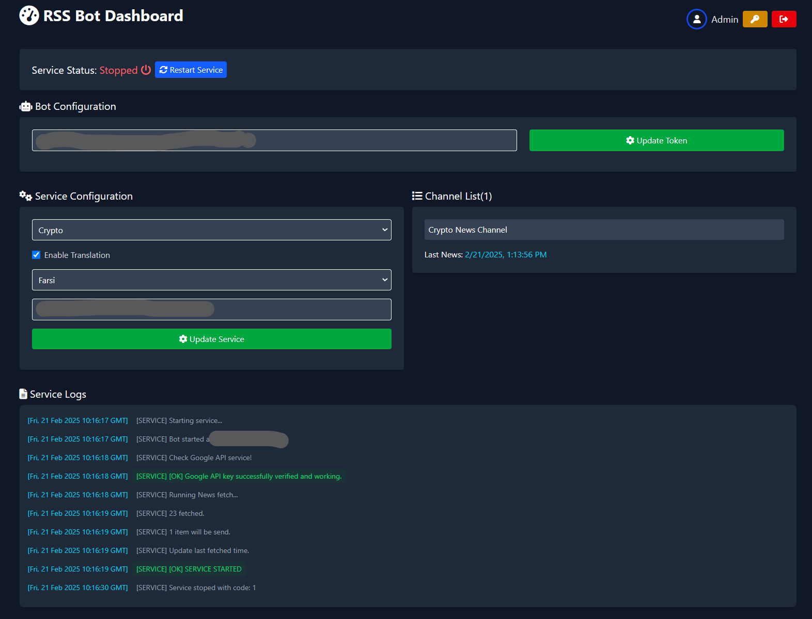

# RSS Bot Dashboard

[](LICENSE)
[](package.json)


A Telegram bot dashboard that automatically fetches and forwards news from multiple RSS sources to your Telegram channels. Supports real-time translation using Google Cloud Translate API to deliver content in your preferred language. Manage multiple news categories and channels through an intuitive dashboard interface.

## Key Features

- Multi-source news aggregation from top RSS feeds (crypto, tech, business)
- AI-powered translation for 5+ languages using Google Cloud Translate API
- Centralized management for multiple Telegram channels
- Real-time content delivery with configurable filters
- Customizable posting schedules and frequency presets
- Support for simultaneous RSS source monitoring
- Language customization per channel/audience
- Automatic content parsing and formatting

## Prerequisites

- Node.js (LTS version recommended)
- Yarn package manager
- Telegram Bot Token (you can get this from [@BotFather](https://t.me/botfather))

## Environment Variables

Create a `.env` file in the root directory with the following variables:

```
TELEGRAM_BOT_TOKEN=your_telegram_bot_token
SECRET=your_secret_key
SERVICE_NAME=your_service_name
```

## Installation

1. Clone the repository:

```bash
git clone https://github.com/TelegramBotDashboards/rss-bot.git
cd rss-bot
```

2. Install dependencies:

```bash
yarn install
```

## Authentication

The dashboard comes with a default administrator account:

- Username: `admin`
- Password: `admin`

**Important**: For security purposes, it is strongly recommended to change these credentials after your first login.

## Building the Application

To build the application, run:

```bash
yarn build
```

## Running the Application

To start the server, run:

```bash
yarn start
```

## Development

To run the application in development mode:

```bash
yarn dev
```

## Preview

To preview production version

```bash
yarn preview
```

## Environment Variables Description

- `TELEGRAM_BOT_TOKEN`: Your Telegram bot token obtained from BotFather
- `SECRET`: A secret key used for securing your application
- `SERVICE_NAME`: The name of your service instance

## Security Notice

Never commit your `.env` file to version control. Make sure it's included in your `.gitignore` file.

## Contributing

We welcome contributions! To contribute:

1. Fork the repository
2. Create your feature branch: `git checkout -b feat/your-feature-name`
3. Commit your changes
4. Push to your fork: `git push origin feat/your-feature-name`
5. Open a Pull Request against the main branch of the original repository

Please ensure your code follows project conventions and any new features are properly documented. Make sure to keep your branch updated with the latest changes from the main repository and verify all tests pass before submitting.
